# CKKS算法
## 1. 概述
CKKS(Cheno-Kim-Kim-Song)是一种支持浮点数进行近似值计算的全同态加密方法。传统的全同态加密算法是在解密时通过取模将明文与噪声隔开获得精确明文值。再CKKS中将噪声视为明文的一部分，以预定的精度输出明文近似值。
在同态计算中，计算结果的高有效位(MSBs)能够保留，低有效位(LSBs)在重缩放的过程中被舍弃: 将重要的信息放在MSBs，将误差放在LSBs。CKKS算法的依赖性依赖于(R)LWE困难问题假设。

### 浮点数同态计算

BGV和BFV都存在问题，就是同态计算的噪声增长会淹没明文的最高有效位(MSBs)。例如BGV算法解密结构 $ <c,s>=m+te \bmod q $ ，其中明文模为t，密文模为q，c是对m的加密，te相当于把e放大t倍，即把e放到最高位(MSBs)，最低位(LSBs)腾出t位。明文消息位数小于t。
进行一次同态乘法后，噪声规模急剧增长，明文规模急剧增长，有可能明文的长度超过了t位（明文模），这个时候可以看作噪声淹没了明文之积最高位。

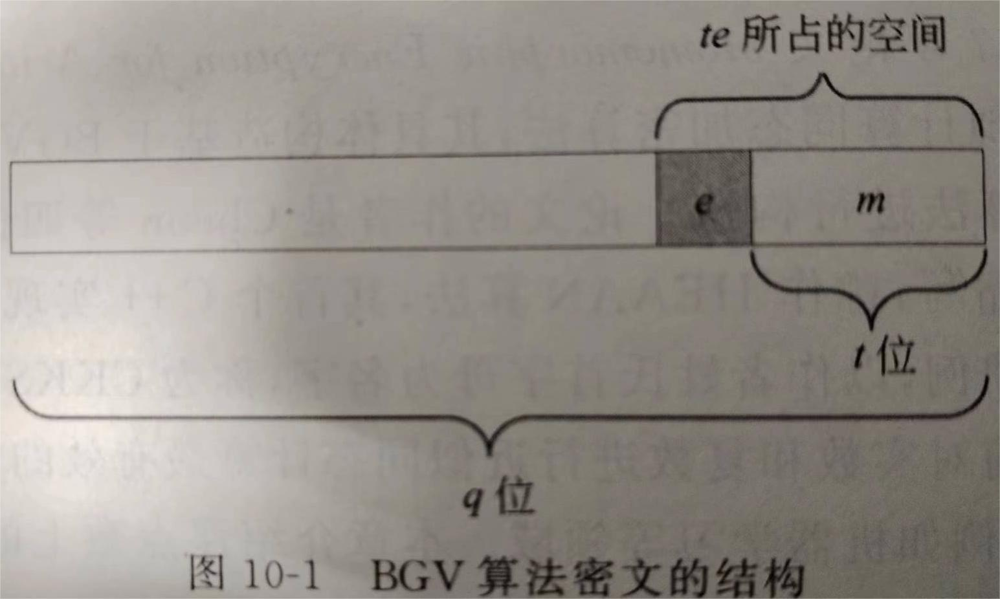
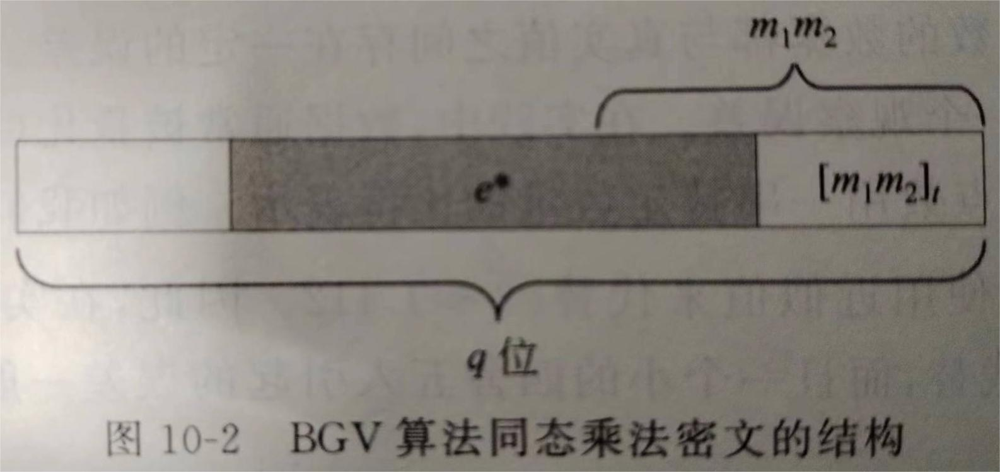

早期同态加密算法中，处理该问题的方法是通过扩大密文模的长度（指数级增长）增长明文空间和容纳近似计算带来的噪声增长，因此需要指数级模来满足近似计算的电路深度。

CKKS解决该问题的方法是将加密引入的噪声视为误差的一部分，进行近似计算。例如密文解密后为m+e，如果e远小于明文m，则e只会摧毁m的低位，对m的高位没有影响。

为了防止m有效位的损失，一般加密前对m乘一个缩放因子（scaling factor），这样可以使得e不会对m有效数字造成影响，使得保持一个较小的解密结构，模值也不会太大。

但是随着同态计算不断执行，明文长度也会随着电路深度呈指数增长。要约简明文长度，保持有效数字的精度位数是主要问题。
因此CKKS中有一个“重缩放、再缩减（rescaling）”技术，首先固定需要保证的精度，然后再对密文 $ c $ 除以 $ p $ 得到 $ \left \lfloor p^{-1}c \right \rceil $ ，对应明文成了 $ m/p $ ,噪声成了 $ e/p $ 。这个过程约减了密文模大小，去除了明文最低有效位包含的计算误差，类似于四舍五入的操作。

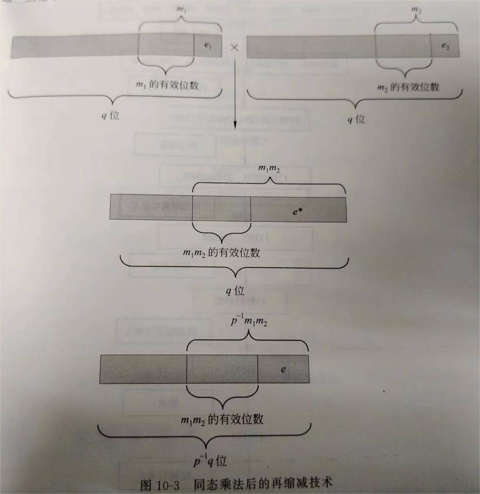

### CKKS背景
[参考博客](https://blog.csdn.net/qq_45358572/article/details/125403483)
#### 提出背景

1978年，Rivest、Adleman和Dertouzos在文献[1]中就贷款公司数据库的保密问题与计算问题进行了讨论，并首次提出了同态加密的加密方式。后来，随着云计算、大数据、人工智能、机器学习等新兴技术不断兴起，人们越来越发现同态加密对于现阶段信息安全的重要性。2009年，Gentry首次提出自举技术[2]，实现了第一个全同态加密方案。2010年，Dijk又首次实现了基于整数环上FHE的DGHV方案[4]。2012年，Kipnis等人给出了基于矩阵和多项式的无噪声FHE方案[5]。2016年，Jaschke等人通过将有理数近似表示为整数[6]，实现了明文空间为实数的FHE方案。2017年，Cheon等人实现了可进行浮点数近似计算的层次型FHE方案[3]（下文称CKKS方案），一年后，Cheon等人又通过自举技术，将CKKS方案扩展为全同态加密方案[7]，同年，也通过RNS实现了CKKS方案的RNS变体[8]。

#### 研究进展
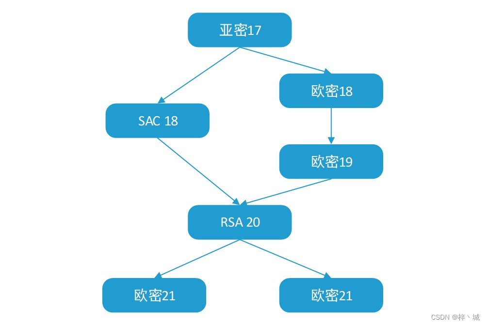
欧密18[7] 给出了CKKS方案的自举方案，欧密19[9] 对其进行了改进；而SAC18[8] 则是提出了CKKS方案的RNS变体，但是其使用的是欧密18中的自举方案，自举精度远达不到实际需求；故在RSA20[10] 中，又结合欧密19中的自举改进对RNS-CKKS方案的自举进行了改进；21年的欧密会上，又有两个方案被相继提出，一个是在RSA20的基础上对自举精度进行了提升[11] ，另一个则是提出了一种新的自举方案[12]，相较之前的方案，精度、效率和安全性上都有了明显的提升。

## 2. 整体流程
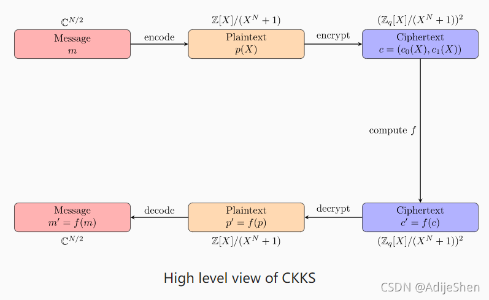

如上图所示，CKKS先将明文 $ m \in \mathbb{C}^{N/2} $ 编码到一个多项式环 $ \mathbb{Z}[X]/X^N+1 $ 上得到多项式 $ p(x) $ ，然后加密得到 $ (c_0(x),c_1(x))\in (\mathbb{Z}_q[X]/X^N+1)^2 $ ，解密、解码过程与加密、编码过程相反。

大致计算流程如下：

选择合适的基 $ p > 0 $ , 模数 $ q_0 $ , 令 $ q_l = p^l \cdot q_0, 0 < l \le L $ ;
1. 密钥生成 $ KeyGen(1^{\lambda}) $ : 
输入安全参数 $ \lambda $ ，选择合适的二次幂分圆多项式 $ M=M(\lambda, q_L) $ ，正整数 $ h=h(\lambda,q_L) $ ， 整数 $ P=P(\lambda,q_L) $ 和 $ \sigma=\sigma(\lambda,q_L) $ 。抽取 $ s \longleftarrow \mathcal{HWT} (h), a \longleftarrow \mathcal{R}_{q_L},  e \longleftarrow \mathcal{DG}(\sigma^2) $ 。令私钥 $ sk \longleftarrow (1,s) $ , 公钥 $ pk \longleftarrow (b,a) \in \mathcal{R}_{q_L}^2 $ ，其中 $ b \longleftarrow -a \cdot s+e\ mod\ q_L $ 。抽取 $ a' \longleftarrow \mathcal{R}_{P \cdot q_L}, e' \longleftarrow \mathcal{DG}(\sigma^2) $ ,计算公钥 $ evk \longleftarrow (b',a') \in \mathcal{R}_{P\cdot q_L}^2 $ , 其中 $ b' \longleftarrow -a' \cdot s+e'+Ps^2\ mod\ P \cdot q_L $ 。算法输出 $ (sk,pk,evk) $ 
2. 加密算法 $ CKKS.Enc_{pk}(m) $ : 选取 $ v \longleftarrow \mathcal{ZO}(0.5) $ 及 $ e_0,e_1 \longleftarrow \mathcal{DG}(\sigma^2) $ ，输出密文 $ c=v \cdot pk+(m+e_0,e_1)\ mod \ q_L $ ;
3. 解密算法 $ CKKS.Dec_{sk}(c) $ ：对于密文 $ c = (b,a) $ ,输出明文 $ m=b+a \cdot sk\ mod\ q_l $ ;
4. 同态加法 $ CKKS.Add(c_1,c_2) $ : 对于两个密文 $ c_0,c_1 \in \mathcal{R}_{q_l}^2 $ , 输出 $ c_{add} \leftarrow c_1+c_2\ mod\ q_l $ ;
5. 同态乘法 $ CKKS.Mul(c_1,c_2) $ : 对于 $ c_1=(b_1,a_1), c_2=(b_2,a_2) \in \mathcal{R}_{q_l}^2 $ ，计算 $ (d_0,d_1,d_2) = (b_1b_2,a_1b_2+a_2b_1,a_1a_2)\ mod\ q_l $ 输出： $ c_{mult}\leftarrow(d_0,d_1)+ \left \lfloor P^{-1}\cdot d_2 \cdot evk \right \rceil\ mod\ q_l $ 
6. 重缩放 $ CKKS.RS_{l\leftarrow l'}(c) $ : 对于 $ c \in \mathcal{R}_{q_l}^2 $ ，输出 $ c' \leftarrow \left \lfloor \frac{q_{l'}}{q_l} \cdot c \right \rceil \bmod q_{l'} $ 

注：
1. $ \lambda $ 是一个安全等级参数
2. $ \mathcal{HWT}(h) $ 表示从 $ \{0, \pm1\}^N $ 中抽取一个N维向量，该向量的Hamming weight为 $ h $ ；对于 $ \sigma > 0 $ , $ \mathcal{DG}(\sigma^2) $ 表示从 $ \mathbb{Z}^N $ 中抽取一个N维多项式向量，每一个系数都满足方差为 $ \sigma^2 $ 的离散高斯分布； $ \mathcal{ZO}(\rho) $ 表示从 $ \{0,\pm1\}^N $ 中抽取一个N维向量,其中1和-1抽取到的概率为 $ \rho/2 $ ， 抽取到0的概率为 $ 1-\rho $ 。

## 3. CKKS编码与解码
实现 $ \mathbb{C}^{N/2} \rightleftharpoons \mathbb{R}=\mathbb{Z}[X]/(X^N+1) $ 相互转化
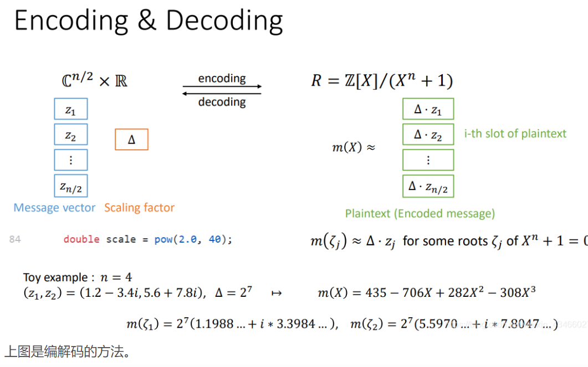

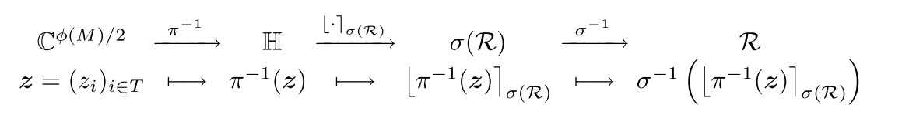

消息向量为 $ z $ , 编码是将消息向量编码为多项式 $ m(X)\in \mathbb{Z}[X]/(X^N+1) $ , 解码就是将本原根带入多项式计算 $ m(\xi_i)=\Delta \cdot z_i $ 。将解码转换定义为 $ \sigma(m)=\{m(\xi^{1}),m(\xi^{3}),...,m(\xi^{2N-1})\} $ , 将编码过程定义为 $ \sigma^{-1} $ 。
其中 $ \Delta $ 为缩放因子(scaling factor)， 用于保证精度，编码时先乘 $ \Delta $ 再做“坐标随机取整”, 解码之后乘 $ \Delta^{-1} $ 得到明文。

整个编码的过程：先使用 $ \pi^{-1} $ 变换扩展明文空间( $ \mathbb{C}^{N/2} \Rightarrow \mathbb{C}^{N} $ )，先乘缩放因子 $ \Delta $ ，再做“坐标随机取整”( $ \mathbb{C}^{N} \Rightarrow \mathbb{Z}^{N} $ )，再使用变换 $ \sigma^{-1} $ 得到编码的多项式( $ \mathbb{Z}^{N} \Rightarrow \mathbb{Z}^N/(X^N+1) $ )，

整个解码过程：与编码过程相反。

编解码可以用下面的矩阵向量乘形式表达（此处省略了缩放因子 $ \Delta $ ）:
 $$ {\textstyle \sum_{j=1}^{N-1}}\alpha_j(\xi^{2i-1})^j=z_i,i=1,2,...,N \Rightarrow A\alpha=z $$ 

 $$ A=\begin{pmatrix}
  &1  &\xi^1  &... &\xi^{N-1}\\
  &1  &\xi^3  &... &\xi^{3(N-1)}\\
  &...  &...  &... &...\\
  &1  &\xi^{2N-1}  &... &\xi^{(2N-1)(N-1)} 
\end{pmatrix}, \alpha= \begin{pmatrix}
 \alpha_0\\
 \alpha_1\\
...\\
 \alpha_{N-1} 
\end{pmatrix}, z= \begin{pmatrix}
 z_0\\
 z_1\\
...\\
 z_{N-1} 
\end{pmatrix} $$ 
其中A为关于 $(\xi^{2i-1})_{i=1,2,...,N} $ 范德蒙德矩阵， $ \alpha $ 为多项式系数, $z $ 是需要编码的复数向量。

其中 $ \xi^i $ 是分圆多项式本原根。M次分圆多项式 $ \Phi_M(X)=X^N+1 $ , 分圆多项式具体见第9节，度数 $ N=\phi(M) $ (欧拉函数)， $ N $ 是2的幂次，此时 $ M=2N $ , 令 $ \xi_M=e^{2i\pi/M} $ 为M次单位原根, 分圆多项式有N个本原根，记为 $ \xi^i $ ， $ i\in \mathbb{Z}_M^* $ (i为模M的剩余类，个数为 $ \phi(M) $ )

例如： $ M=8，N=4，i=1,3,5,7 $ 
> 注1：这里还有另一种方法构造 $\mathbb{Z_M^*} $ 和本原根：
> 例如将5作为生成元，可以构造一个阶为 $N/2 $ 的模的乘5循环群 $\{5^j \bmod M|j \in[0,N/2] \} $ 此外这个群乘-1也构成一个乘5循环群 $\{-5^j \bmod M|j \in[0,N/2] \} $ 这两个乘法群构成一个完整的 $\mathbb{Z_M^*} $ 
>
>例如：对于M=16，两个阶位4的乘法群为[1,5,9,13], [15,11,7,3]。
>
>对于分圆多项式 $ \Phi_M(X)=X^N+1 $ 的某个M次单位原根 $\zeta $ , 令 $\zeta_j=\zeta^{5^j}, 0\le j<N/2 $, ${\zeta_{j}, \overline{\zeta_{j}}: 0 \leq j<N / 2} $ 组成了单位原根的集合。
>
> 例如：对于 $X^8+1 $ :
> $\zeta_0=\zeta $, $\zeta_1=\zeta^5 $, $\zeta_2=\zeta^{9} $, $\zeta_3=\zeta^{13} $,
>
> $\bar{\zeta}_0=\zeta^{15} $, $\bar{\zeta}_1=\zeta^{11} $, $\bar{\zeta}_2=\zeta^7 $, $\bar{\zeta}_3=\zeta^3 $,
>
> 此时解码编码函数也可以写成下面的形式：
>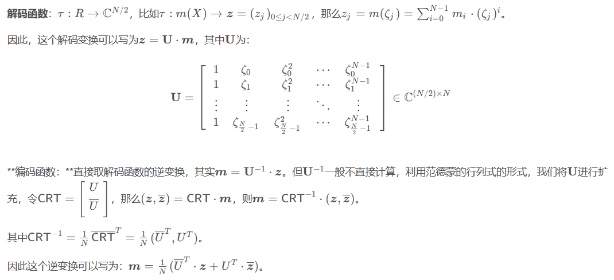

> 注2：
>
>(1) 首先将 $ \mathbb{C}^{N/2} $ 扩展为 $ \mathbb{C}^{N} $ ： $ \mathbb{H} = \{z\in \mathbb{C}^N|z_j=\bar{z_{N-j}}\}, $ ；
>
>(2) $ \sigma(\mathbb{R}) \subset \mathbb{H} $ ;
>
>(3) $ \pi:\ \forall t \in \mathbb{H}, \pi(t)=(t_0,t_1,...,t_{N/2})\in \mathbb{C}^{N/2} $ : 逆操作 $ \pi^{-1} $ 就是将向量取共轭，然后拼接到原向量尾部，实现向量扩展；
>
>(4) 编码： $ m(X)=\sigma^{-1}(\left \lfloor \Delta\cdot\pi^{-1}(m) \right \rceil_{\sigma(R)}) $ ；
>解码： $ m(\xi_i)= \triangle \cdot z_i $ ， $ z=\pi \circ \sigma(\Delta^{-1} \cdot m(X)) $ ；

## 4. CKKS的Bootstrapping
自举过程涉及到模数提升、解码、正弦近似、编码的过程。

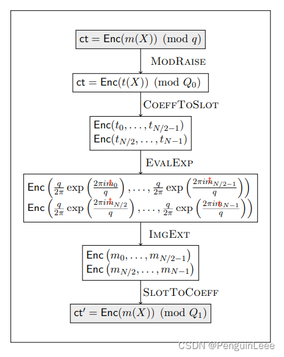
>(1) 假设有一个层数耗尽的密文 $ ct=(c_0,c_1)\bmod Q_l $ ，对应的明文多项式： $ m(X)=c_0+c_1s\bmod q $ ，若解密时不模q，模 $ Q_0(Q_0>>q) $ ，记为 $ t(X)=c_0+c_1s \bmod Q_0 $ , $ t=qI+m $ , $ I $ 为不太大的整数；体现在密文中就是密文的模数提升了， $ (c_0,c_1)\bmod Q_l $ 变为 $ (c_0,c_1)\bmod Q_0 $ ， $ Q_0 $ 和 $ Q_l $ 为q的倍数。
>
>(2) 将加密的明文多项式 $ t(X)=(c_0+c_1s)\bmod Q_0 $ 做密文下的解码运算。这里解码是将 $ X $ 用原根进行带入，得到解码后的向量 $ t\bmod Q_0 $ ，该过程可以通过矩阵向量乘法运算实现。由于“编码”“解码”的可逆性，t包含的信息没有被消除。
>
>(3) 我们要对 $ t\bmod Q_0 $ 在密文下进行正弦近似，得到 $ t \bmod q=m $ , 即获得真正的明文m（由于模数的存在，m和 $ t \bmod Q_0 $ 本质上不同），最后再进行编码，将t编码为 $ t(X) $ 
>
>注意: 这里Bootstrapping的过程本身也要进行大量的HE计算，消耗乘法深度。

 这里可能有个小问题，在加密的情况下进行编解码会否改变明文？当然不会，这里编解码实际上就是一个矩阵向量乘的过程，加法乘法满足同态性。 

注：**CKKS的Bootstrapping与其他Bootstrapping的区别**
1. 不需要Bootstrapping密钥；
2. 计算复杂度是 $ O(log(||sk||_1\cdot q)) $ ；
3. 需要的内存较小；

## 5. CKKS的同态加法和乘法

### 5.1 加法
给出两个密文 $ c=(c_0,c_1) $ 和 $ c'=(c_0',c_1') $ , 分别对应明文 $ u, u' $ , s密文加法如下：
 $$ \mathcal{C}_{Add}\left( c,c' \right)=\left( c_0+c_{0}',c_{1}+c_{1}' \right)=c+c'=c_{add} $$ 
对该结果进行解密可以得到：
 $$ Decrypt(\mathcal{C}_{Add},s) = c_0+c_0'+(c_1+c_1')\cdot s = c_0+c_1 \cdot s+c_0'+c_1' \cdot s $$ 
 $$ =Decrypt(c,s)+Decrypt(c',s) = u+e+u'+e' $$ 
 $$ Decrypt(c,s)=c_0+c_1\cdot s $$ 
在做加法时非常简单,直接将密文相加即可，而且加法所造成的噪声增长是线性的。

### 5.2 乘法
需要找到两个操作 $ \mathcal{C}_{Mult} $ 和 $ DecryptMult $ ，使得对于两个密文： $ c=(c_0,c_1) $ 和 $ c'=(c_0',c_1') $ , 分别对应明文 $ u, u' $ ，有： $ DecryptMult(\mathcal{C}_{Mult}(c,c'),s)=Decrypt(c,s)\cdot Decrypt(c',s) $ 
 $$ Decrypt(c,s)\cdot Decrypt(c',s)=(c_0+c_1\cdot s)\cdot(c_0'+c_1'\cdot s) $$ 
 $$ =c_0\cdot c_0'+(c_0\cdot c_1'+c_0'\cdot c_1)\cdot s+c_1\cdot c_1'\cdot s^2=d_0+d_1\cdot s+d_2\cdot s^2 $$ 
乘法结果看作关于 $ s $ 的二次多项式，因此可以将密文乘法写为：
 $$ \mathcal{C}_{Mult}(c,c')=\mathcal{c}_{mult}=(d_0,d_1,d_2)=(c_0\cdot c_0',c_0\cdot c_1'+c_0'\cdot c_1,c_1\cdot c_1') $$ 
这里可以看到密文大小增加了，如此下去进行多次乘法，密文规模呈指数增长，因此我们需要采用一种方法解决密文规模增长过快的问题，这就是重线性化，详细见第9节。

这里还有一个问题，CKKS将明文编码为多项式，再进行加密。后续密文乘法实际上就是多项式乘法，这里一般采用NTT（数论变换，Number Theoretical Transfer）将多项式转换为点值形式逐点相乘，并采用逆变换iNTT将点值形式再转换为多项式系数形式。NTT具体流程参考[NTT](./NTT.md)

## 6. CKKS的同态旋转(也可以叫移位，rotation)
什么是旋转？为什么需要这个过程？需要先解释一下这个问题。

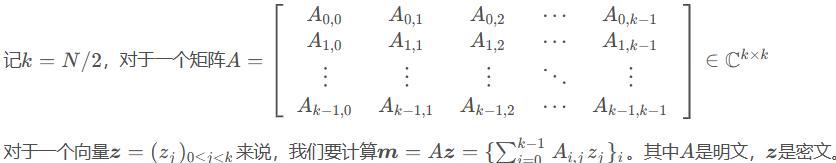

在计算矩阵向量乘法时，例如 $m=Az$ 其中A是明文，z是密文，要在打包的情况下进行计算，打包支持的乘法运算是向量点乘，矩阵乘法是每行做了内积。所以如何在明文打包的情况下，通过向量两两乘法来构造一个矩阵乘法是一个难点。

如下图，如果采用一般的思路，就需要分别加密k个密文 $\{z_i,...,z_i \}_{0\le i<k} $ ，采用改进的思路就可以只用一个密文 $\{z_0,...,z_{k-1} \} $ 。

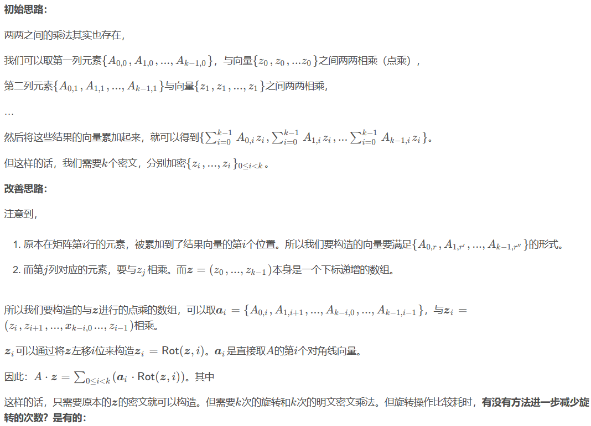

采用小步大步法减少旋转次数：

### 6.1 明文
在明文状态下进行rotation很简单。例如下图，将 $x $ 替换为 $x^5 $ 再通过模运算就可以得到旋转结果。
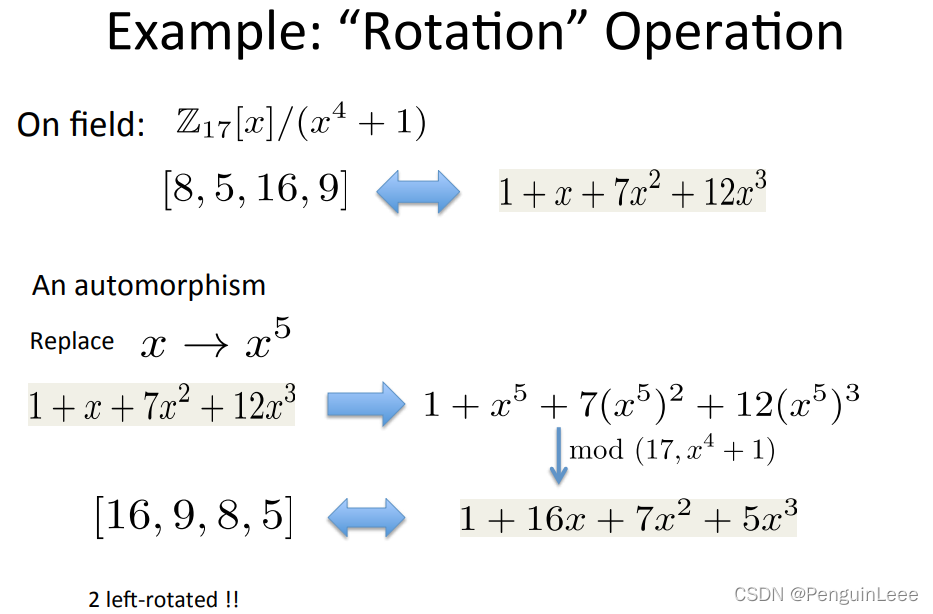

### 6.2 密文
由于旋转一般是在同态计算过程中用到的，因此一般是在密态下对密文进行旋转，。密文下进行rotation就复杂一些了，需要用到一个KeySwitch的过程，详见8节。
这里设密文为 $ ct=(b,a) $ , 解密方法为： $ b+a\cdot s=m+e $ 。

密文旋转, 我们可以看做是找到一个映射 $ \varphi $ , 使得 $ \varphi(ct)=(\varphi(b),\varphi(a)) $ ，其中密文 $ \varphi(ct) $ 对应的私钥是 $ \varphi(s) $ 对应的明文是 $ \varphi(m) $ ： $ \varphi(b)+\varphi(a)\cdot \varphi(s)=\varphi(m)+\varphi(e) $ 

在密文 $ ct $ 上进行 $ \varphi(\cdot) $ 变化，通过使用 $ KeySwitch $ 将密文 $ ct $ 变为密文 $ \varphi(ct) $ (私钥为 $ s $ 明文为 $ \varphi(m) $ )，实现旋转： $$ rk_r=KSGen_s(\varphi_r(s)) $$ 
 $$ Rot(ct;r)=KeySwitch(\varphi(ct),rk_r) $$ 

>注：求共轭的思想与旋转（rotation）一致，也就是将 $\varphi $ 替换为 $\varphi(x):x^{-1} $ 
>
>例如将 $[\zeta,\zeta^5,\zeta^9,\zeta^{13}] $ 变成 $[\zeta^{15},\zeta^{11},\zeta^{7},\zeta^3] $ 对应共轭操作

## 7. 重缩放
在编码时为了保证精度，乘了一个缩放因子(scaling factor） $ \Delta $ ,此时明文为 $ \Delta\cdot z $  当执行密文乘法时，所对应明文变成了 $ \Delta^2\cdot z_1z_2 $ , 放大因子呈指数增长，因此需要引入重缩放(再缩减，rescaling)技术，每次同态乘法后对密文除以 $ \Delta $ , 将明文变为 $ \Delta\cdot z_1z_2 $ 。

重缩放技术的目的在于保证缩放因子不变，同时也约减了噪声。

全同态加密中，密文的模q的大小决定了能够执行同态乘法的次数。每次乘法都消耗一个模数q，从而形成了一系列逐步变小的模： $ q_L, q_{L-1}, ...,q_1 $ ，这个就是模链。 $ L $ 称为层级, 本质上表示还能执行多少次同态乘法，每执行一次同态乘法，例如当前处于 $ L $ 层，同态乘法执行后模数从 $ q_L $ 变为 $ q_{L-1} $ ， 因此设置模q的大小之前需要提前知道具体的计算深度。

这里需要注意，模q的值越大越不安全。CKKS方案困难性基于q/N。因此为了安全，在增大q时，同时增大多项式次数N。对于其他基于格的全同态加密方案一样。 

假设需要执行L次乘法，放大因子为 $ \Delta $ （ $ \Delta $ 表示需要保持小数部分位数的精度），可以设置 $ q=\Delta^Lq_0 $ , 其中 $ q_0 \ge\Delta $ , 这样形成了一个模链： $ q_i/q_{i-1}=\Delta $ 。例如我们需要保留30位小数精度，整数保留10位精度，执行8次同态乘法，可以设置： $ \Delta=2^{30},q_0=2^{30+10} $ ，则 $ 2^{30\times 8+40}=2^{280} $ 。

具体的重缩放过程如下：乘法计算后将得到的密文除以放大因子，再进行摄入操作。

例如：密文 $ c $ 对应模为 $ q_i $ , 执行重缩放： $$ RS_{i\rightarrow i-1}(c)=\left\lfloor\frac{q_{i-1}}{q_i}c\right\rceil\bmod q_{i-1} $$ 

注：同态乘法之后需要先执行重线性化，再执行重缩放：顺序为(1)同态乘法(2)重线性化(3)重缩放；

## 8. 密钥转换(KeySwitch)
简而言之，KeySwitch要做的就是：将一个对应私钥 $ s' $ 的密文 $ ct_1 $ 转化为对应私钥 $ s $ 的密文 $ ct $ , 这两个密文均对应相同明文 $ m $ ;
 $$ ct_1=(b_1,a_1), ct=(b,a) $$ 
转化密 $ ksk $ 生成：
 $ ksk=KSGen_{s}(s') $ 
取 $ a'\in \mathcal{R}_{PQ} $ ,  $ b'=a's+e'+Ps' \bmod PQ $ , 转换密钥 $ (b',a') $ 

密钥转换过程： $ ct \leftarrow KeySwitch(ct_1,ksk) $ 
 $$ (b,a)=(b_1,0)+\left\lfloor P^{-1}\cdot a_1\cdot ksk \right\rfloor\bmod Q $$ 
此时得到的密文 $ ct $ 现在对应的私钥就是s了。

> 正确性推导：
>   $$b+as = b_1+\lfloor P^{-1}\cdot a_1\cdot b' \rfloor + (\lfloor P^{-1}\cdot a_1\cdot a' \rfloor)s $$  
>   $$ =b_1+ P^{-1}\cdot a_1\cdot (-a's+e'+Ps')  + P^{-1}\cdot a_1\cdot a's + \epsilon $$
>   $$ =b_1+a_1s'+P^{-1}a_1e'+\epsilon$$
>   $$ =m+e_1+P^{-1}a_1e'+\epsilon $$ 
>   $$\approx m$$

用途：同态rotation、求共轭；

## 9. 重线性化

前面提到 $ DecryptMult(\mathcal{C}_{Mult}(c,c'),s)=Decrypt(c,s)\cdot Decrypt(c',s)=d_0+d_1\cdot s+d_2\cdot s^2 $ ，其中 $ (d_0,d_1,d_2)=(c_0\cdot c_0',c_0\cdot c_1'+c_0'\cdot c_1,c_1\cdot c_1') $ ;

重线性化的本质就是：找到一对多项式 $ (d_0',d_1')=Relin(c_{mult}) $ :
 $$ Decrypt((d_0',d_1'),s)=d_0'+d_1'\cdot s=d_0+d_1\cdot s+d_2\cdot s^2=Decrypt(c,s)\cdot Decrypt(c',s) $$ 
具体来说重线性化就是保证解密的时候只需要用到s，而不需要用到s的平方，因此每次执行完成密文乘密文的乘法后进行重线性化，可以得到大小不变的密文，采用相同的解密电路。

现在需要定义Relin，我们需要找到一对多项式使得： $ d_0'+d_1'\cdot s=d_0+d_1\cdot s+d_2\cdot s^2 $ ; 可以定义 $ (d_0',d_1')=(d_0,d_1)+P $ , 其中 $P $ 表示一对多项式，例如最简单的： $ Decrypt(P,s)=d_2\cdot s^2 $ 

>这里可以设置一个计算密钥用于计算 $P $ ，  $ evk=(-a_0\cdot s+e_0+s^2,a_0) $ , 其中 $ e_0 $ 是一个小的随机多项式， $ a_0 $ 是一个在 $ R_q $ 上均匀采样的多项式，然后我们计算 $ Decrypt(evk,s)=e_0+s^2 $ , 这个计算密钥 $ evk $ 可以公开，基于RLWE问题的困难性是很难根据该计算密钥提取出 $ s $ 的。
>
>此时，为了解密出 $ d_2\cdot s^2 $ , 可以计算  $ P=d_2\cdot evk =(d_2\cdot (-a_0\cdot s+e_0+p\cdot s^2),a_0) $ , 然后 $ Decrypt(P,s)=d_2\cdot s^2+d_2\cdot e_0 $ , 但是又有个新问题，在实际情况中 $ d_2\cdot e_0 $ 会比较大而导致无法忽略，进而导致噪声过大解密失败。

>为了解决这个问题，可以稍微修改计算密钥： $ evk=(-a_0\cdot s+e_0+p\cdot s^2,a_0)(\bmod p\cdot q) $ ，其中p是一个大整数， $ a_0 $ 从 $ R_{p\cdot q} $ 中随机采样得到。在解密时除以p可以去除上面 $ d_2 $ 相乘时产生的噪声：
> $$ \frac{Decrypt(evk,s)}{p}=\frac{e_0+p\cdot s^2}{p}\approx s^2 $$ 
>因此可以得到： $$ P=\left\lfloor p^{-1}\cdot d_2\cdot evk\right\rfloor\pmod q $$ 
>即： $$ Decrypt(P,s)=p^{-1}\cdot d_2\cdot e_0+d_2\cdot s^2\approx d_2\cdot s^2 $$ 
>其中 $ p^{-1}\cdot d_2\cdot e_0 $ 很小可以约去。

将重线性化定义为： $$ Relin((d_0,d_1,d_2,evk))=(d_0,d_1)+\left\lfloor p^{-1}\cdot d_2\cdot evk\right\rfloor $$ 

## 10. 分圆多项式
使用分圆多项式的好处：（1）保证了环LWE问题的分布随机性；（2）另一方面能够提高计算效率；

在全同态加密中，利用分圆多项式的分解特性，可以结合中国剩余定理将多个明文打包到一个密文中

n次分圆多项式是 $ x^n-1 $ 的一个“最大”的不可约多项式因子。最大的意思是对于任意  $ k<n $  , 该n次分圆多项式都不是  $ x^k-1 $  的因子。

>通常把满足 $x^n=1 $ 的根称为n次单位根，其中 $n=1,2,3,... $ 。如果 $z $ 是一个n次单位根，则满足 $z^n=1 $ 。如果n次单位根是远哥，则n是满足 $z^n=1 $ 的最小幂，即对于任何 $0<k<n $ , 都有 $z^k\neq 1 $ 。
>
>还有一个重要性质：若 $z $ 为n次单位原根，则 $z $ 的整数幂：$z,z^2,...,z^{n-1} $ , $z^n=z^0=1 $ 均互不相同，这说明一个重要的特征：$z $ 相当于生成元。用一个n次单位原根可以生成所有的单位根。当 $z $ 为n次单位根时，则 $z $ 的整数幂也是n次单位根。
>
>如果 $z $ 是 $n $ 次原根，当 $k $ 和 $n $ 互素时， $z^k $ 是n次原根，则一共有 $\varphi(n) $ 个n次单位原根。 $\varphi(n) $ 为欧拉函数。

>还有一个重要的性质，就是这些n次单位原根可以通过三角函数表示。三角函数有性质： $(\cos x+i\sin x)^n=\cos nx+i\sin nx $ 。令 $x=2\pi/n $ 相当于对圆进行n等分，代入上式有： $(\cos\frac{2\pi}{n}+i\sin\frac{2\pi}{n})^n=\cos 2\pi + i\sin 2\pi=1 $ 。说明 $\cos\frac{2\pi}{n}+i\sin\frac{2\pi}{n} $ 是一个n次单位根，但是 $(\cos\frac{2\pi}{n}+i\sin\frac{2\pi}{n})^k\neq 1,(k=1,2,...,n-1) $ ,所以 $\cos\frac{2\pi}{n}+i\sin\frac{2\pi}{n} $ 是一个n次单位原根，其中 $2\pi/n $ 相当于对圆n等分。

例如当n=5时，相当于对圆5等分：

<image src="../../resources/pictures/5circle.jpg" width="300" height="330">

根据欧拉公式 $e^{ix}=\cos x+i\sin x $ 可以使用 $e^{2\pi i\frac{k}{n}}(0\le k <n) $ 表示所有的n次单位根, 特别的当k与n互素时，时n次单位原根。

n次分圆多项式为 $\Phi_n(x) $ ，该次数n就是n次单位原根的个数，即 $\varphi(n) $ 。
当k与n互素时，$e^{2\pi i\frac{k}{n}}(0\le k <n) $ 可以表示所有的n次单位原根，所以分圆多项式可以表示为： $$\Phi_n(x)= \prod_{1\le k\le n\ gcd(k,n)=1}(x-e^{2i\pi \frac{k}{n}})$$ 
由于每个n次单位根要么是n次单位原根，要么是某个d次单位原根。所以 $x^n-1 $ 可以表示为 $\prod_{d|n}\Phi_d(x)=x^n-1 $。

分圆多项式在有理数域上不可约，所以 $\Phi_n(x) $ 是在环 $\mathbb{Z}[x] $ 上次数为 $\varphi(x) $ 的不可约多项式。

>最小多项式：假设a是域F（元素个数为n）的任意元素，a的次数d是n的因子,则a的最小多项式为:
> $$f_{\alpha}(x)=(x-\alpha)(x-\alpha^q)...(x-\alpha^{q^{d-1}}) $$ 

## 11. RNS-CKKS(CKKS的变体)
为了有效地实现多项式运算，Gentry等人基于CRT提出了一种双CRT表示的分圆多项式表示方案[1]。第一层CRT层通过使用RNS将多项式分解成具有较小模的多项式分量。第二层则是通过NTT的方法，将每个小多项式转换为整数向量。在双CRT表示中，任意多项式都可以用由小整数组成的矩阵来识别，并且可以通过执行不同分量的模操作来实现有效的多项式运算。

### 11.1 Residue number system(RNS, 剩余数系统)
为了有效的操作大整数吗，CKKS一般会应用RNS。在 $R_Q $ 中，所有的整数运算都是相对于多项式模量 $Q $ 的模运算。这里可以将 $Q $ 设置为一些列RNS质数的积： $q_0,...,q_{L-1} $ , 每一个质数都足够小与机器字长相匹配，可以将多项式的每个系数进行分解(中国剩余定理)：
$$RNS:a \rightarrow(a\bmod q_0,a\bmod q_1,...,a\bmod q_{L-1}) $$
这样，大整数运算就可以被一系列的 $L $ 并行的模 $q_i $ 运算取代。

RNS将一个度为N-1的多项式转换为 $L\times N $ 矩阵。每一行称为多项式的一个分支，每一行与质数 $q_i $ 相联系。每一个分支可以被视作一个 $R_{q_i} $ 的单个多项式。
在进行多项式乘法等计算时，(i)NTT分别计算每个多项式分支。

### 11.2 Base conversion(BConv, 基底转换)
当两个多项式具有不同的多项式模量时，采用BConv来匹配模量。当必须将一个多项式 $P\in R_Q $ 用一个evaluation key $evk \in R_{PQ}^{2\times dnum} $ 做乘法时（同态乘HMult、同态rotation HRot）， 需要进行BConv，这个过程与key switching过程相似。

HMult计算采用单个evk（$evk_{mult} $）,HRot计算采用分离的evk（$evk_{rot}^{(r)}$），r表示旋转的位数。要求HMult和HRot采用一个辅助模数：$P= {\textstyle \prod_{i=0}^{K-1}} p_i $ 和 $ Q={\textstyle \prod_{i=0}^{L-1}} q_i$。每一个 $p_i$ 大于 $max(q_i) $。 

使用RNS，可以将每个 $evk $ 转换为 $dnum=\left \lceil L/K \right \rceil $(分解数目)对 $(L+K)\times N$的矩阵。

BConv的计算包含一个 $P\in R_Q $ 的 $ L\times N $ 的矩阵和一个基表（base table） $K\times L $ 矩阵的乘法，得到结果 $P' \in R_P $ 的 $K\times N $矩阵。 $P' $ 与 $P $ 拼接得到一个扩展多项式（extended polynomial）$P''\in R_{PQ} $， 一个 $(L+K)\times N $ 矩阵。一个类似的转换 $R_{PQ} \rightarrow R_Q $ 也是用BConv。BConv要求输入在计算前用系数表示，因此序列 $INTT\rightarrow BConv \rightarrow NTT $ 比较常见。

### RNS-CKKS流程
Cheon等人提出了CKKS方案的RNS变体[2]，实现了在RNS上的近似全同态加密方案，具体算法如下：
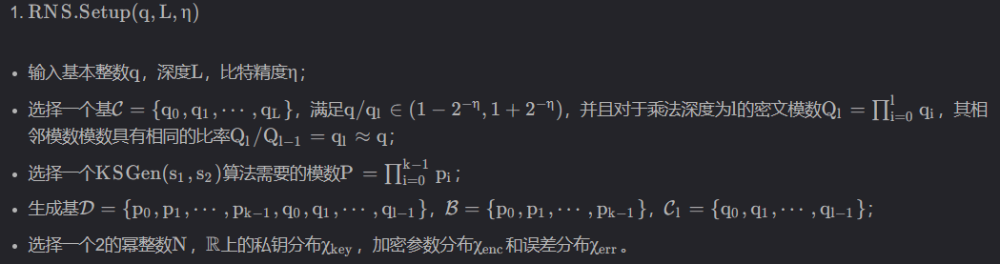
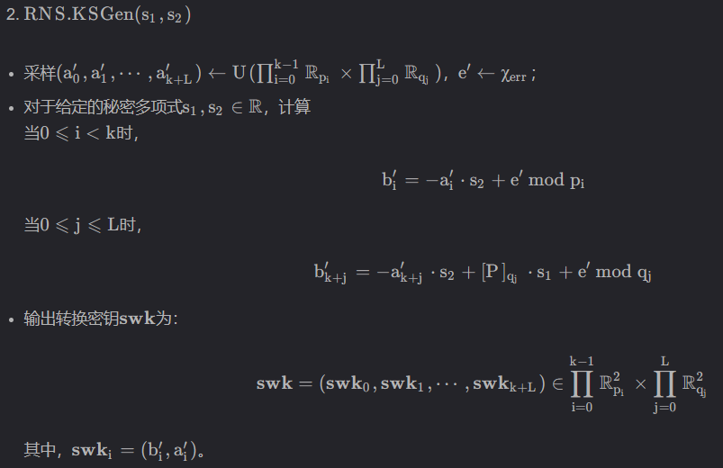

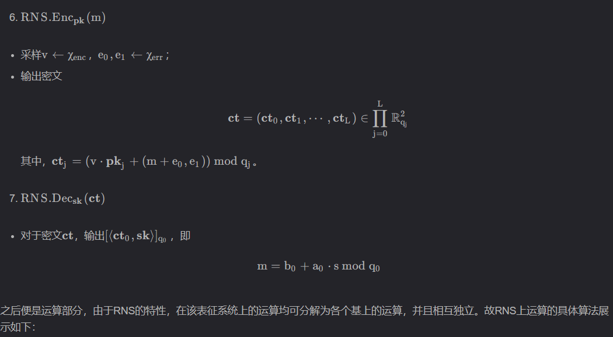
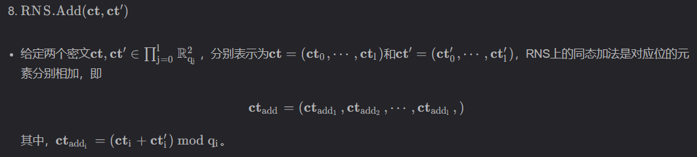
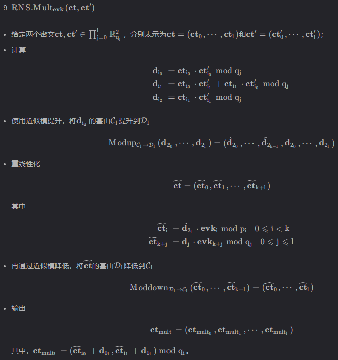
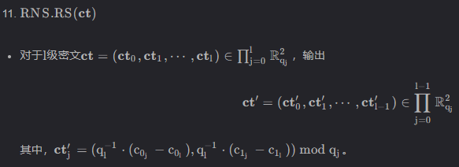

注：

## 12. CKKS的安全性

## Q&A
1. 

## 参考文献
参考文献
[1] Rivest R L , Adleman L M , Dertouzos M L . On Data Banks and Privacy Homomorphisms[J]. Foundations of Secure Compuation, 1978.

[2] Gentry C . Fully homomorphic encryption using ideal lattices[J]. Stoc, 2009.

[3] Cheon J H , Kim A , Kim M , et al. Homomorphic Encryption for Arithmetic of Approximate Numbers[C]// International Conference on the Theory and Application of Cryptology and Information Security. Springer, Cham, 2017.-1

[4] Dijk M V , Gentry C , Halevi S , et al. Fully Homomorphic Encryption over the Integers[C]// International Conference on Theory & Applications of Cryptographic Techniques. Springer, Berlin, Heidelberg, 2010.

[5] Aviad Kipnis E H . 1 Efficient Methods for Practical Fully-Homomorphic Symmetric-key Encryption, Randomization, and Verification[J]. Urban Research & Practice, 2012, 7(3):255-257.

[6] Jschke A , Armknecht F . Accelerating Homomorphic Computations on Rational Numbers[J]. Springer, Cham, 2016.

[7] Cheon J H , Han K , Kim A , et al. Bootstrapping for Approximate Homomorphic Encryption[J]. Annual International Conference on the Theory and Applications of Cryptographic Techniques, 2018.-2

[8] Cheon J H , Han K , Kim A , et al. A Full RNS Variant of Approximate Homomorphic Encryption[J]. Selected areas in cryptography :. annual international workshop, SAC. proceedings. SAC (Conference), 11349:347-368.-2

[9] Chen H , Chillotti I , Song Y . Improved Bootstrapping for Approximate Homomorphic Encryption[C]// International Conference on the Theory & Applications of Cryptographic Techniques. Springer, Cham, 2019.-3

[10] Han K , D Ki. Better Bootstrapping for Approximate Homomorphic Encryption[C]// Cryptographers’ Track at the RSA Conference. Springer, Cham, 2020.-4

[11] Lee J W , Lee E , Lee Y , et al. High-Precision Bootstrapping of RNS-CKKS Homomorphic Encryption Using Optimal Minimax Polynomial Approximation and Inverse Sine Function[M]. 2021.-5

[12] Bossuat J P , Mouchet C , Troncoso-Pastoriza J , et al. Efficient Bootstrapping for Approximate Homomorphic Encryption with Non-sparse Keys[M]. 2021.-5

[13] Gentry C , Halevi S , Smart N P . Homomorphic Evaluation of the AES Circuit[C]// Annual Cryptology Conference. Springer, Berlin, Heidelberg, 2012.
