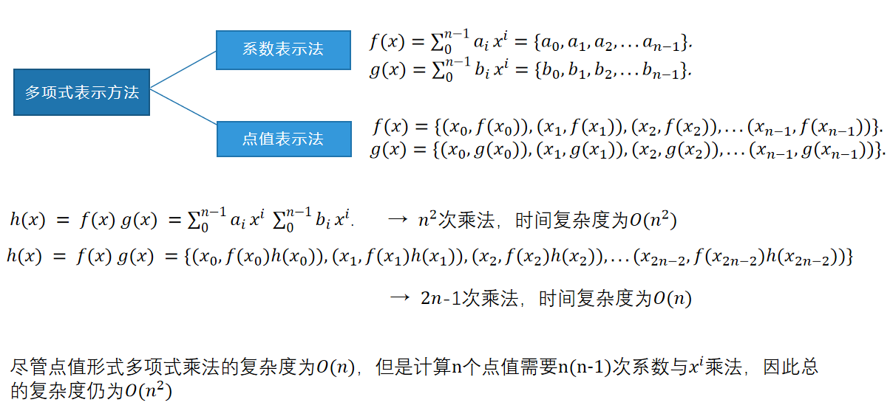

# NTT
数论变换（Number-Theoretic Transform，NTT）是一种在整数环上进行的快速变换算法，用于在模数意义下高效地计算多项式乘法或卷积。NTT可以看作是快速傅里叶变换（FFT）在有限域或整数环上的一种推广。

与FFT类似，NTT也采用了分治策略，将多项式乘法问题分解为更小规模的子问题，并通过递归地解决这些子问题来得到原问题的解。然而，与FFT不同的是，NTT是在模数意义下进行计算的，因此它避免了FFT中可能出现的浮点数精度问题。

NTT的基本思想是将输入序列通过一种特殊的变换转换到频域，在频域中进行逐点相乘，然后再通过逆变换将结果转换回时域。这种变换是通过选择适当的模数和原根来实现的，以确保在模数意义下的计算正确性和高效性。

NTT在计算机科学和密码学等领域中有广泛的应用，特别是在需要高效计算多项式乘法的场景中。例如，在密码学中，NTT可以用于加速基于多项式的加密算法和签名方案的实现。在计算机科学中，NTT也可以用于信号处理、图像处理等领域中的卷积计算。
## 1.NTT的作用

