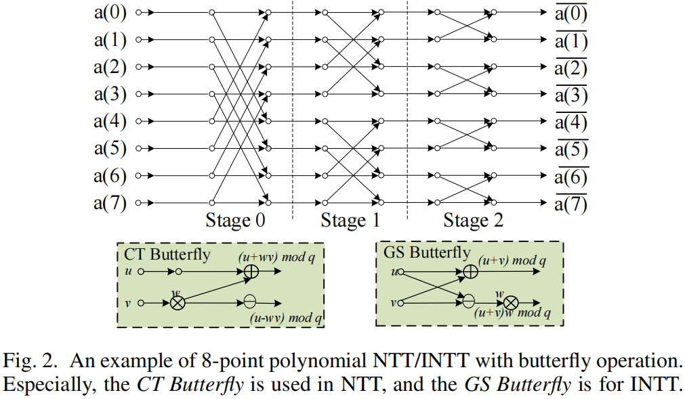

# NTT(Number Theoretic Transformer)
数论变换（Number-Theoretic Transform，NTT）是一种在整数环上进行的快速变换算法，用于在模数意义下高效地计算多项式乘法或卷积。NTT可以看作是快速傅里叶变换（FFT）在有限域或整数环上的一种推广。

与FFT类似，NTT也采用了分治策略，将多项式乘法问题分解为更小规模的子问题，并通过递归地解决这些子问题来得到原问题的解。然而，与FFT不同的是，NTT是在模数意义下进行计算的，因此它避免了FFT中可能出现的浮点数精度问题。

NTT的基本思想是将输入序列通过一种特殊的变换转换到频域，在频域中进行逐点相乘，然后再通过逆变换将结果转换回时域。这种变换是通过选择适当的模数和原根来实现的，以确保在模数意义下的计算正确性和高效性。

NTT在计算机科学和密码学等领域中有广泛的应用，特别是在需要高效计算多项式乘法的场景中。例如，在密码学中，NTT可以用于加速基于多项式的加密算法和签名方案的实现。在计算机科学中，NTT也可以用于信号处理、图像处理等领域中的卷积计算。
## 1.NTT的作用

## 2.大致流程
### 2.1 NTT和INTT
设 $\psi  $ 为一个整数域的N次单位原根，对于给定的N和质数q，有 $\psi_N^N \equiv 1\bmod q $ 。根据费马小定理，对于质数q，至少存在一个原根g满足 $g^{(q-1)}\equiv1\bmod q $ , 生成N次单位原根 $\psi_N=g^{(q-1)/N}\bmod q $ 。
NTT整体算法可以表示为：
$$A_k=\sum_{n=0}^{N-1} (a_n\psi_{(N,q)}^{nk}\bmod q),k\in[0,N) $$
$a_n $ 表示输入多项式的第n个系数，$A_k $ 表示输出多项式的第k个系数。$\psi_{(N,q)} $ 表示$Z_q $ 的NTT's unity的N次原根。
因此，INTT算法表示为：
$$a_k=\frac{1}{N}\sum^{N-1}(A_n\psi_{(N,q)}^{-nk}\bmod q),k\in [0,N) $$
$\psi_{(N,q)}^{-1} $ 表示$Z_q $ 的INTT's unity的N次原根。并且根据费马小定理，有$\psi_{(N,q)}^{-1}=\psi_N^{(q-2)} $ 。
### 2.2 多项式乘法
基于NTT，两个多项式 $A(X),B(X) $ 的乘法可以表示为 $$A(X)\cdot B(X)=INTT(NTT(A(X))\odot NTT(B(X))) $$ 

这里由于两个最高次数均为 $N-1 $ 多项式相乘得到的多项式最高次数为 $2(N-1) $ 。要进行INTT，就需要 $2(N-1)+1=2N-1 $ 个点值对。为了实现这个就需要在NTT时将每个 $N-1 $ 次多项式转化为 $2N-1 $ 个点值对（这个可以使用0对多项式填充到次数为 $2N-1 $ ，将超过N-1次的系数设为0，再进行NTT），但是这个就更复杂了，需要的原根数目也 $\times 2 $ 。

于是，可以利用负循环卷积来维持多项式环 $Z(X)/(X^N+1) $ 中的乘法。在多项式环中的结果的系数乘积与负循环卷积的输出相同。
所以多项式乘法可以表示为：
$$\bar{c}=\Psi^{-1}\odot INTT(NTT(\bar{a})\odot NTT(\bar{b})) $$
$$\Psi^{-1}=\{1,\psi_{(2N,q)}^{-1},\psi_{(2N,q)}^{-2},...,\psi_{(2N,q)}^{-(N-1)}\} $$
$\odot $ 表示两个多项式系数element-wise的乘法。$\bar{a},\bar{b},\bar{c} $ 分别是 $A(\psi_{(2N,q)}\cdot X), B(\psi_{(2N,q)}\cdot X), C(X) $的系数。通过使用NTT/INTT将 $\psi_{(2N,q)} $ 与 $\Psi^{-1} $ 结合起来，用负循环卷积的NTT新公式可以表示为：
$$A_k=\sum_{n=0}^{N-1}((a_n\psi_{2N}^{2nk+n})\bmod q) $$
上述公式具有极高的计算复杂度，因此为了解决这个问题，提出了Cooley-Tukey和Stockham两种算法将计算复杂度从 $O(N^2) $ 转换为 $O(N\log N)$ 

如上图所示，Cooley-Tukey和Stockham算法使用蝶形运算来计算 $N/（2i） $ $stage_i $ 的两个元素， $stage_{(i+1)} $ 取决于之前的阶段产生的结果，导致相邻阶段之间的数据依赖问题。很多工作利用split-radix技术来缓解依赖问题，它将NTT的N点划分为k个交错的N/k点NTT（也称为radix-kNTT）。然而，radix-k NTT很难消除所有的依赖问题，并且不可避免地需要额外的同步。在[1]中，通过用矩阵乘法完成NTT算法来消除依赖问题。

## 参考文献
[1] Fan S, Wang Z, Xu W, et al. Tensorfhe: Achieving practical computation on encrypted data using gpgpu[C]//2023 IEEE International Symposium on High-Performance Computer Architecture (HPCA). IEEE, 2023: 922-934.