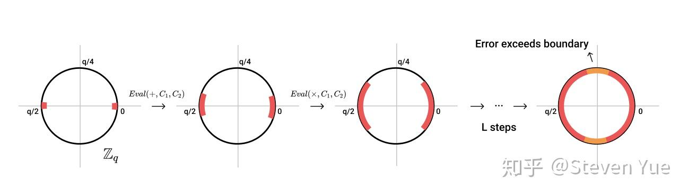

## 1. 概述   
   GSW是第三代全同态加密的开山之作，是后续FHEW、TFHE的基础。其主要采用矩阵近似特征向量原理以及LWE来构造一种近似全同态（LFHE），再通过bootstrapping（Genntry09）操作实现全同态。本篇文章主要讲述GSW是如何构造全同态加密；会具体到一些基础的细节，比如LWE问题的原理、全同态加密的一般构造过程、bootstrapping原理等。本篇文章默认阅读者已经有一些密码学、线性代数基础，否则可以先移步密码学数学基础知识。
## 2. LWE(Learning With Error)
   首先，为了便于理解LWE是什么，先引入Learning without error的概念：
   比如，Alice有一组私钥(private key)，为一个向量，同时用私钥生成如下图右所示的方程组，即为公钥(public key):   
   

   
显然，这里私钥就是公钥的解。我们需要私钥不能够被外界轻易获取，但是事实上外界通过公钥解方程很容易就能得到私钥，这就是Learning Without Error，我们不能通过这种方法来进行对数据的加密。
   而此时如果我们对公钥对应的方程中加入一些随机的噪声数据，事情似乎就变得有意思起来，如下图所示：
   

  
   
此时，如果把这个已经添加过噪声的方程组作为公钥交由外部去操作，那么外部似乎是不那么容易获取我们的秘密信息--私钥了。事实上，这个充满错误的线性方程组是不可能求出正确解的，太多的方程限制了变量的值。这便是LWE问题的一般原理，外部无法通过一个充满错误的系统中获取正确的信息。   
      
   我们现在知道了这个原理，那么如何利用这个原理来进行一些数据的加密解密呢？仍以上述内容为例，给出Regev加密的流程。  
   需要注意的是，在密码学领域，一般运算都是在有限域下进行的（伽罗瓦域），这样做有一个好处是将数据约束在一定范围内。比如上述线性方程中，所有数据都要模一个素数89，得到下图所示公钥方程：
   

   
首先，Bob获取到了公钥中的三条数据：  

   $77x+7y+28z+23w=8(mod89)$

   $21x+19y+30z+48w=39(mod89)$ 

   $4x+24y+33z+38w=20(mod89)$

   之后Bob将这三个方程进行相加，得到方程 $13x+50y+2z+20w=68(mod89)$ ，如果Bob想发送一个二进制的1，那么Bob则将该方程的右侧加上45（即89/2的向上取整，模数q是公开的），得到 $13x+50y+2z+20w=24(mod89)$，此时再将数据发送给Alice。此时Alice该怎么解密呢？事实上只要代入私钥即可！

   代入私钥之后，Alice得到 $13x+50y+2z+20w=69$ ，与Bob发来加密的数据进行对比，可知69与24差异较大，远远超出噪声可能的范围（一般应用时都会约束噪声的范围），因此可以得知Bob送来的是信息1。当Bob送来的数据为0时，也是直接代入私钥进行对比，此时差异在一个被约束的范围内，因此可以认为是0.

   以上便是一种典型的利用LWE进行数据加密解密的方法，即把一个bit的值映射到一个有限域的两头。

   总结来说，一个LWE问题实例会随机生成一个比较大的矩阵 **$A$**（对应上述中的没有错误的线性方程组），和一个不公开的私密向量**s**（对应上述线性方程组的解）。给定一个**A**以及带有误差的乘积(**As**+**e**)，求出未知向量**s**的问题，叫做搜索LWE问题(DLWE)。还有一种LWE问题叫做决策LWE问题(DLWE)，是分辨看到的一组矩阵与向量到底是一个LWE实例(**A**,**As**+**e**)还是随机生成的(**A**,**v** $\in$ $\mathbb{Z}_{q}^{m}$)。一个合理构造的SLWE与DLWE在格密码学中都被定义为困难的问题。

   在我们懂了这种LWE的原理之后，我们继续学习GSW中如何用LWE问题来构造一个LFHE（Leveled Fully Homomorphic Encryption）近似全同态。
## 3. LFHE(Leveled Fully Homomorphic Encryption)
   GSW中使用的方法是矩阵近似特征向量。我们在矩阵特征向量公式中引入噪声，有以下公式：
   $$C \cdot \vec{s} = \mu \cdot \vec{s} + \vec{e}$$
   之后我们进行体系的构造：
   ### 密钥生成
   $KeyGen$：我们随机生成一个私密向量 $\widetilde{s}\in \mathbb{Z}_{q}^{n-1}$ ，然后我们在这个向量的最末尾加上一个-1，构成我们的新向量（即密钥向量）
   $$\overrightarrow{s} = (\widetilde{s},-1)$$
   ### 加密算法ENC
   $Enc(\overrightarrow{s},\mu\in \mathbb{Z}_{q})$:我们基于上述商城的密钥构建一个LWE问题实例。首先我们随机生成一个矩阵$A\in \mathbb{Z}^{n\times(n-1)}$与一个随机噪声向量$\overrightarrow{e}\in x_{B}^{n}$，（$x_{B}^{n}$是一个最大绝对值为B的随机分布），基于此生成密文$C$：
   $$C = \underbrace{(A,A\cdot\widetilde{s}+\overrightarrow{e})}_{LWE Instance}+\overbrace{\mu\cdot I_n}^{message}\in \mathbb{Z}_{q}^{n\times n} $$
   这里等式中的$I_n$是一个$n\times n$的单位矩阵。

   观察这里的密文构造方法，可以看出我们构造了一个LWE实例$(A,A\cdot \widetilde{s}+\overrightarrow{e})$，并将其拼接成了一个$n\times n$的矩阵，再将想要加密的信息$\mu\cdot I_n$叠加上去。*因为DLWE问题假设，我们可以把这个过程看作一个One-Time Pad，即叠加一个随机值的过程。* 这个过程在密码学中认为是安全的。

   ### 解密算法Dec
   $Dec(\overrightarrow{s},C)$:我们解密一个密文矩阵$C$，实际上只需要计算$C\cdot \overrightarrow{s}$，再观察得到的结果大约是$\overrightarrow{s}$的几倍即可解密得知现在被加密的数据是多少。**事实上最困难的一部就是观察得到结果，因为对于人来说通过观察可以简单的得出结论，但是计算机是不会观察的。**
   接下来我们分析一下这个解密算法的正确性：
   $$\begin{aligned}\begin{split}C \cdot \overrightarrow{s} &=((A,A\cdot \widetilde{s}+\overrightarrow{e})+\mu\cdot I_n)\cdot \overrightarrow{{s}}\\&=(A,A\cdot \widetilde{s}+\overrightarrow{e})\cdot \overrightarrow{{s}}+\mu\cdot I_n\cdot \overrightarrow{{s}}\\&=A\cdot \widetilde{s}-(A\cdot\widetilde{s}+\overrightarrow{e})+\mu\cdot\overrightarrow{s}\\&=\mu\cdot\overrightarrow{s}-\overrightarrow{e}\end{split}\end{aligned}$$
   非常的amazing！通过密文与密钥相乘就把明文解出来了。并且我们最终的关系式$C\cdot \overrightarrow{s} = \mu\cdot\overrightarrow{s}\pm\overrightarrow{e}$ 就是我们一开始提出的特征向量等式加入噪声版本！需要注意的是，因为我们在LWE问题中定义的噪声只是绝对值需要符合一个上限B的随机量，所以不管是加一个噪声还是减一个噪声，本质上没有任何区别。  
   我们也可以从此得知该方法“矩阵近似特征向量”名称的由来了！
   ### 运算算法Eval
   接下来我们要分析该加密算法构造的同态属性：  

   $Eval(+,C_1,C_2)\rightarrow C_1 + C_2$:如果我们需要计算两个明文之间的加法，那么只需要将**密文矩阵相加**即可。即新的密文$C_3=C_1+C_2$，显然如果$C_3$解密出的结果恰为二者的明文之和，即可验证正确性：
   $$\begin{aligned}
   C_3 \cdot \overrightarrow{s} &= (C_1 + C_2)\cdot \overrightarrow{s}\\
   &=C_1\cdot\overrightarrow{s} + C_2 \cdot \overrightarrow{s}\\&=(\mu_1 + \mu_2)\cdot\overrightarrow{s}+(\overrightarrow{e}_1+\overrightarrow{e}_2)
   \end{aligned}
   $$
   显然加法同态性是得到了证明，密文中的噪声也会被叠加起来，最大噪声为$2B$，是原来的两倍。

   $Eval(\times,C_1,C_2)\rightarrow C_1 \cdot C_2$:计算明文乘法只需要将**密文矩阵进行矩阵乘法**即可。同样的证明方法，$C_3 = C_1 \cdot C_2$：
   $$\begin{aligned}
   C_3 \cdot \overrightarrow{s} &= (C_1 \cdot C_2)\cdot \overrightarrow{s}\\
   &=C_1\cdot (C_2 \cdot \overrightarrow{s})\\&=C_1\cdot(\mu_2\cdot\overrightarrow{s}+\overrightarrow{e}_2)\\
   &=\mu_2\cdot(C_1\cdot\overrightarrow{s})+C_1\cdot\overrightarrow{e}_2\\
   &=\mu_2\cdot(\mu_1\cdot\overrightarrow{s}+\overrightarrow{e}_1)+C_1\cdot\overrightarrow{e}_2\\
   &=\mu_1\cdot\mu_2\cdot\overrightarrow{s}+\mu_2\cdot\overrightarrow{e}_1+C_1\cdot\overrightarrow{e}_2
   \end{aligned}
   $$
   观察输出结果，可以看出结果中是有明文相乘项。但是同样可以看出，结果中出现了两个随机噪声相关的量:$\mu_2\cdot\overrightarrow{e}_1$及$C_1\cdot\overrightarrow{e}_2$。
   如果想要正确还原出解密的结果，那必须保证噪声项不能大到足以淹没有效数据！我们针对这两项噪声进行分析：
   第一项噪声$\mu_2\cdot\overrightarrow{e}_1$，由于噪声绝对值上限为B，那么这一项的取值上限即为$\mu\cdot B$，为了使这一项的噪声尽量小，我们一次只加密1bit的数据，及$\mu$的最大值为1，这样该项噪声取值上限仍为B。   
   第二项噪声$C_1\cdot\overrightarrow{e}$的大小似乎没有那么容易处理了。因为$C_1\in \mathbb{Z}_{q}^{n\times n}$，即$C_1$中每个数的值上限有q这么大，我们计算第二项噪声得到的结果向量中的 每个数的数值最大会有$n\cdot B\cdot q$这么大，即使B的值非常小，这个数值仍非常容易突破噪声容量最大值(一般该容量最大值小于$q/2$)。从而导致解密失败。 

   ### 二进制分解
   由上述分析可知，现在构造方法得到的密文无法保证乘法同态性（因为密文运算同态乘法后噪声过大，无法解密）。我们现在重新观察第二项噪声，其实可以发现$C_1\cdot \overrightarrow{e_2}$取值过大是因为$C_{ij} \in \mathbb{Z}_q$，即$C$矩阵的元素都是在$\mathbb{Z}_q$中取值的。**因为我们在解密时只需要看结果向量中的一项就可以判断明文$\mu$的大小，所以我们关心的也是结果向量中的一项的大小**。此时我们引入一个小工具：**二进制分解**。

   如果我们拥有一个数字$x \in \mathbb{Z}_q$，我们可以将这个数字用一串bit表示出来（实际就是数字的二进制表示，但是是向量），定义其$\hat{x}$为$x$的二进制分解态：
   $$
   \hat{x}=(x_{\left \lceil log(q) \right \rceil -1},...,x_2,x_1,x_0)\in (0,1)^{\left \lceil log(q) \right \rceil}
   $$
   同理，如果我们有一个向量$v \in \mathbb{Z}_q^{n}$，我们对$v=(v_{n-1},...,v_{2},v_{1},v_{0})$进行二进制分解：
   $$\hat{v}=(v_{0,\left \lceil log(q) \right \rceil-1},...,v_{0,0},v_{1,\left \lceil log(q) \right \rceil-1},...,v_{1,0},...,v_{\left \lceil log(q) \right \rceil-1,\left \lceil log(q) \right \rceil-1},...,v_{\left \lceil log(q) \right \rceil-1,0})$$
   可知，此时$\hat{v} \in \mathbb{Z}_2^{n\times \left \lceil log(q) \right \rceil}$。

   显然，如果我们想要分解一个$m \times n$的矩阵$C$，只需针对该矩阵的每行向量单独进行二进制分解即可。如下所示：
   $$C = \begin{pmatrix}C_0 \\C_1 \\... \\C_{m-1}\end{pmatrix} \rightarrow \hat{C}=\begin{pmatrix}\hat{C_0} \\\hat{C_1} \\... \\\hat{C_{m-1}}\end{pmatrix}
   $$
   此时$\hat{C}\in \mathbb{Z}_2^{m\times (n\cdot \left \lceil log(q) \right \rceil)}$

   如果我们想要将一个二进制分解态的矩阵还原，其实际为一个线性变换的过程，可以用乘以一个**二进制重组矩阵G**来实现。
   $$\begin{aligned}
   C &= \hat{C}\cdot G\\
   &=\begin{pmatrix}\hat{C_0} \\\hat{C_1} \\... \\\hat{C_{m-1}}\end{pmatrix} \cdot G\\
   &=\begin{pmatrix}C_{0,0,\left \lceil log(q) \right \rceil-1} &\dots& C_{0,0,0}& \dots &C_{0,n-1,\left \lceil log(q) \right \rceil-1}&\dots &C_{0,n-1,0}\\ \dots& \dots&\dots&\dots&\dots&\dots&\dots\\ \dots&\dots&\dots&\dots&\dots&\dots&\dots \\ C_{m-1,0,\left \lceil log(q) \right \rceil-1} &\dots& C_{m-1,0,0} &\dots& C_{m-1,n-1,\left \lceil log(q) \right \rceil-1}&\dots& C_{m-1,n-1,0} \end{pmatrix} \cdot G
   \end{aligned}
   $$

   可以证明：
   $$
   G = \begin{pmatrix}
   2^{\left \lceil q \right \rceil-1}& 0 & \dots & 0\\
   \vdots& \vdots & \ddots & \vdots\\
   2^1& 0 & \dots & 0\\
   2^0& 0 & \dots & 0 \\
   0&  2^{\left \lceil q \right \rceil-1}& \dots & 0\\
   \vdots&  \vdots& \ddots & \vdots\\
   0& 0 & \dots & 2^0 
   \end{pmatrix}_{n\cdot \left \lceil log(q) \right \rceil\times n}
   $$
   事实上，我们观察G的最后一行为$G_n=(0,0,0,...,1)$，即只有最后一项为1其余均为0，这一点方便我们后续优化FHE系统的计算。

   因为我们把二进制重组用矩阵G表示，因此我们也常把二进制分解这一过程用$G^{-1}(\cdot)$来表示，即$\hat{C}=G^{-1}(C)$，此时$\hat{C} \in \mathbb{Z}_2^{m \times m}$。

   ### 在构造系统中加入二进制重组
   首先上述讨论到了如果明文$\mu$过大，会导致乘法同态运算中第一个噪声项过大，因此我们一次加密一个二进制bit，即$\mu \in \{0,1\}$。

   我们再进行加密时，首先需要构造LWE问题实例。在定义LWE各项系数的时候，为了使维度相符，我们选择$m=n\cdot \left \lceil log(q) \right \rceil$。然后我们选取随机矩阵$A \in \mathbb{Z}_q^{m\times (n-1)}，随机噪声$\overrightarrow{e} \in x_B^m$。密钥生成与之前过程一致，不再阐述，得到$\widetilde{s}$与$\overrightarrow{s}$。

   此时加密方法与之前略有不同：
   $$
   C = (A,A\cdot \widetilde{s}+\overrightarrow{e}) + \mu\cdot G \in \mathbb{Z}_q^{m \times n}
   $$
   与之前不同的是，这里明文$\mu$乘的是重组矩阵而不是单位矩阵。当我们计算出$C$之后，我们不直接输出$C$，而是输出$C$的二进制分解态$\hat{C}=G^{-1}(C)$作为我们的密文。

   解密方法：由于之前我们输出了C的二进制分解态，我们需要对其进行二进制重组再进行正常的解密运算（乘以私钥）。
   $$\begin{aligned}
   \hat{C}\cdot G \cdot \overrightarrow{s} &= C \cdot \overrightarrow{s}\\
   &=\mu \cdot G \cdot \overrightarrow{s} - \overrightarrow{e}\end{aligned}
   $$
   在上述讨论二进制重组G的特点中，提及了G的特殊性。其实G中每一行只有一个元素是不为0的，其余皆为0，在解密时只需要观察得到的结果向量中，对应的位置的值是否在0附近（噪声在容限范围内）即可判断对应明文是0还是1。

   加法同态比较容易验证，其仍是通过密文相加来获取明文相加结果，这里我直接给出结论：
   $$
   (\hat{C_1}+\hat{C_2}) \cdot G\cdot \overrightarrow{s} = (\mu_1+\mu_2)\cdot G \cdot \overrightarrow{s} - (\overrightarrow{e_1}+\overrightarrow{e_2})
   $$
   同样可以看出噪声是线性增长的。这种增长方式是较为友好的。关键是乘法同态，其运算过程仍为将密文矩阵相乘，下面我们通过解密来验证一下（这里直接给出结论，具体过程自己推导）：
   $$
   (\hat{C_1}\cdot\hat{C_2})\cdot G \cdot \overrightarrow{s} = (\mu_1\cdot \mu_2)\cdot G \cdot \overrightarrow{s} + \mu_2\cdot\overrightarrow{e}_1+\hat{C}_1\cdot\overrightarrow{e}_2
   $$

   此时在观察第二项噪声，会发现$\hat{C}_1\cdot \overrightarrow{e}_2$向量中，每一项最大值为$n\cdot \left\lceil log(q)\right \rceil \times B$，即噪声上限与之前$n\cdot q\cdot B$相比降低了很多。

   尽管通过以上策略将同态乘法的噪声变低，但每进行一次乘法其噪声也会随之变大。比如再进行一次乘法，则会得到三组噪声，并且最大的一组噪声的噪声上限变为$(n\cdot \left\lceil log(q)\right \rceil)^2\times B$，如下推导所示。
   $$\begin{aligned}
   (\hat{C3}\cdot\hat{C1}\cdot\hat{C2})\cdot G \cdot \overrightarrow{s} &= (\mu_1\cdot \mu_2\cdot \mu_3)\cdot G \cdot \overrightarrow{s} + (\mu_1\cdot \mu_2)\cdot \overrightarrow{e}_3 + \hat{C}_3\cdot(\mu_2\cdot\overrightarrow{e}_1+\hat{C}_1\cdot\overrightarrow{e}_2)\\
   &=(\mu_1\cdot \mu_2\cdot \mu_3)\cdot G \cdot \overrightarrow{s} + (\mu_1\cdot \mu_2)\cdot \overrightarrow{e}_3 + \mu_2\cdot\hat{C_3}\cdot\overrightarrow{e}_1+\underbrace{\hat{C_3}\cdot\hat{C}_1\cdot\overrightarrow{e}_2}_{max\_error}
   \end{aligned}
   $$

   因此，此时我们在该系统下仍然只能进行有限次同态运算，我们用一个数字$L$来量化一个噪声区间中可以进行的同态运算次数。也就是说，当我们对于一个刚刚生成的低噪声密文进行L+1次同态运算后（一般为乘法，从上述也可以看出同态乘法增大噪声的速率远快于加法），密文的噪声会过大导致解密失败。下图很好的描述了噪声的增长过程：
   

   

   
   综上，我们成功构造出了一个计算任意计算深度小于$L$的FHE系统（LFHE）。接下来我们讲述bootstrapping及GSW全同态加密的构造过程。

   ### bootstrapping